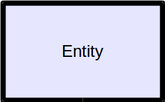
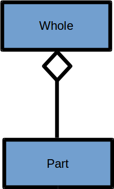
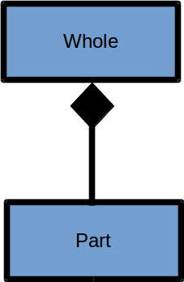
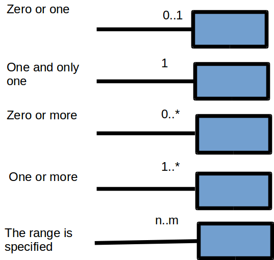
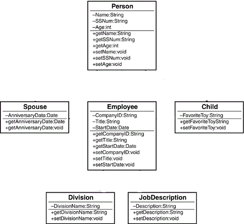

| Title | Type | Duration | Author | 
| -- | -- | -- | -- |
| Java (Backend) Teaching Demo Prompt | Lesson | 00:40 | Suresh Melvin Sigera |

## Objectives

-   How are objects represented
-   How to show relationships between objects
-   How to show cardinality
-   Demonstrate how to implement OOP techniques such as inheritance and polymorphism
-   Employ the SOLID design patterns to follow OOP best practices

### Objects
Structured methods look at a system as a collection of functions decomposed into more primitive functions. Data is secondary in the structured view and concurrency isn't dealt with at all. The object perspective is different in that the fundamental decompositional unit is the object. So what is an object?

#### The short form:
An object is a cohesive entity that has attributes, behavior, and (optionally) state.

#### The long form:
Objects represent things that have both data and behavior. Objects may represent real-world things, like dogs, airfoil control surfaces, sensors, or engines. They may represent purely conceptual entities, like bank accounts, trademarks, marriages, or lists. They can be visual things, like fonts, letters, ideographs, histograms, polygons, lines, or circles. All these things have various features, such as

##### Attributes (data)
 - Behavior (operations or methods) 
 - State (memory) 
 - Identity
 - Responsibilities

In object-oriented programming, the fundamental unit is the object. An object is an entity that serves as a container for data and also controls access to the data. Associated with an object is a set of attributes, which are essentially only variables belonging to the object. Also associated with an object is a set of functions that provide an interface to the functionality of the object, called methods.

    
     
    <b>Instance of a class</b>

    
     
    <b>Instance of a class</b>

### What is a class?
Classes are the foundation of object-oriented programming (OOP). In other words, **classes are abstract templates for objects**. You can also say that objects are instances of classes.  A _class_ specifies both the structure and the defined behavior of the objects instantiated from it. All objects of a class have their own copies of the very _same_ set of typed attributes.

    
     
    <b>Class is a blue print</b>

### Inheritance and Composition
Inheritance and composition play major roles in the design of object-oriented (OO) systems. In fact, many of the most difficult and interesting design decisions come down to deciding between inheritance and composition.

Both inheritance and composition are mechanisms for reuse.  Inheritance, as its name implies, **involves inheriting attributes and behaviors from other classes**. In this case, there is a true parent/child relationship. The child (or subclass) inherits directly from the parent (or superclass). Inheritance represents the **is-a relationship**, for example, a dog  is a mammal. When inheritance is used, the end result is, at least conceptually, a single class that incorporates all of the behaviors and attributes of the inheritance hierarchy. 

    
     
    <b>is-a relationship</b>

Composition involves using other classes to build more complex classes. There is no parent/child relationship in this case. **Basically, complex objects are composed of other objects**. Composition represents a **has-a relationship**. For example, a car  has an engine. Both the engine and the car are standalone objects. However, the car is a complex object that contains (has an) engine object. 

In fact, a child object might itself be composed of other objects; for example, the engine might include cylinders. In fact, a car contains many objects besides an engine, including wheels, a steering wheel, and a stereo. Whenever a particular object is composed of other objects, and those objects are included as object fields, the new object is known as a compound , an aggregate , or a composite object. When composition is used, several different classes are used to build the target class.

    
     
    <b>has-a relationship</b>

### UML
UML, as its name implies, is a modeling language. The UML User Guide defines UML as "a graphical language for visualizing, specifying, constructing and documenting the artifacts of a software-intensive system." UML gives you a standard way to write the system's blueprints. In a nutshell , UML offers a way to graphically represent and manipulate an object-oriented (OO) software system. It is not only the representation of the design of a system, but a tool to assist in this design.

In UML, an  **entity** a.ka. class is represented by a rectangle:

    

**Aggregation** is shown as binary association with a hollow diamond as a symbol of the aggregation at the end of the association line. The part entity can belong to more than one aggregate classifier and it can exist independently of the aggregate.

    

**Composition** is presented as binary association with a black diamond as a symbol of the composition at the end of the association line. A composition specifies that the lifetime of the part entity is dependent on the lifetime of the whole entity.

    

#### Cardinality

When data modeling methods talk about relationships, they use the term cardinality to indicate how many entities may be linked together.

**Relationships**  are solid lines with cardinality specified at the ends of the lines:

    

To determine cardinality, ask the following questions:
- Which objects collaborate with which other objects?
- How many objects participate in each collaboration?
- Is the collaboration optional or mandatory?

#### Example 

Let's consider the following example. We are creating an Employee class that inherits from Person, and has relationships with the following classes:

- Division
- JobDescription
- Spouse
- Child

What do these classes do? Are they optional? How many does an Employee need?

##### Division
- This object contains the information relating to the division that the employee works for.
- Each employee must work for a division, so the relationship is mandatory.
- The employee works for one, and only one, division.

##### JobDescription
- This object contains a job description, most likely containing information such as salary grade and salary range.
- Each employee must have a job description, so the relationship is mandatory.
- The employee can hold various jobs during the tenure at a company. Thus, an employee can have many job descriptions. 
- These descriptions can be kept as a history if an employee changes jobs, or it is possible that an employee might hold two different jobs at one time. For example, a supervisor might take on an employee's responsibilities if the employee quits and a replacement has not yet been hired.

##### Spouse

- In this simplistic example, the Spouse class contains only the anniversary date.
- An employee can be married or not married. Thus, a spouse is optional.
- An employee can have only one spouse.

##### Child

- In this simple example, the Child class contains only the string FavoriteToy .
- An employee can have children or not have children.
- An employee can have no children or an infinite number of children (wow!).
- You could make a design decision as to the upper limit of the number of children that the system can handle.

To sum up, we can represents the cardinality of the associations of the classes we just considered.

|Optional/Association  | Cardinality| Mandatory |
|--|--|--|
|  Employee /  Division | 1 | Mandatory |
|  Employee /  JobDescription| 1 n | Mandatory |
|  Employee /  Spouse| 0 1 | Optional|
|  Employee /  Child| 0 n | Optional |

#### We do

    

